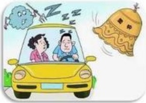
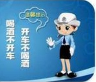
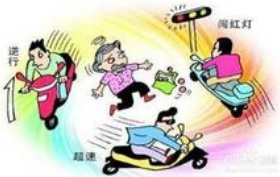
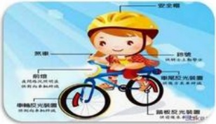

## 机动车驾驶员：

一、不准酒后或者醉酒驾驶车辆。

二、驾驶车辆不准闯红灯。

三、驾驶车辆不准超速行驶。

四、驾驶车辆载客不得超载、超重。

五、不准违规将车乱停乱放。

六、驾驶车辆上道路行驶需放置检验合格标志

七、不准无证驾驶车辆，不准将车辆交予无证人员驾驶

八、不准发生交通事故后逃逸。

九、凡违反上述规定造成交通事故的后果自负，构成犯罪的由司法机关处理。

## DL

## 非机动车：

一、非机动车（电动车、电动自行车、自行车等）应当在非机动车道行驶，不得进入机动车道，没有非机动车道的应当靠车行道的右侧行驶。

二、电动车在非机动车车道内行驶时，最高时速不得超过十五公里。

## 三、 遵守交通规定行驶。

四、助动自行车、有动力装置的残疾人专用车应当接受公安交通管理部门的定期检验，未经公安交通管理部门检验，不得上道路行驶；禁止非机动车加装动力装置，拼装非机动车，擅自更换有动力装置的残疾人专用车、助动自行车的发动机。

