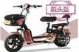
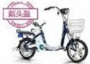
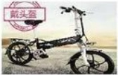
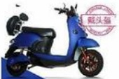
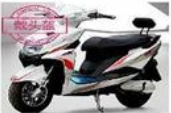
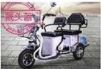
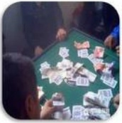
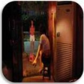
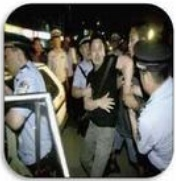
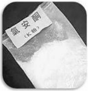

1、骑乘摩托车、踏板电动车、电动自行车正确佩戴头盔，晚上出行佩戴好反光背心；

2、驾驶及乘坐公司车辆及私家车扣好安全带。

注意事项：

1、不允许穿拖鞋、高跟鞋驾驶机动车；

2、行驶途中不允许接打电话：

3、机动车不允许乱停乱放、逆向行驶、超速、疲劳驾驶。

## 生活篇--品行要求

## DÍ

## 五、 品行：

1、不认同、不遵守公司企业文化：

2、随地吐痰、乱扔垃圾；

3、拾遗物品不上交，据为己有；

4、煽动员工闹事或怠工；

5、拉帮结派、搬弄是非、影响工作、破坏团结；

6、对向上级反映情况的人打击报复：

7、公然违抗上级主管或故意刁难下属；

8、不良生活作风、违反公共道德，给公司造成不良影响；

9、造谣、侮辱、猥亵、威胁或勒索同事；

10、盗窃或故意损坏他人财物；

11、对盗窃的违规行为知情不报，不做规劝、互相包庇；

12、私自索要、接受厂家、供应商的赠品；

13、故意隐瞒、弄虚作假或为弄虚作假者提供方便；

14、聚众赌博，吸毒、藏毒、贩卖毒品；

15、参与涉黑组织、传销组织，不合法投资、担保、放贷和借贷；

16、向他人相互借款金额超过一万元以上（包含一万元）（家庭人员医疗应急除外，其它特殊原因向公司申请）

17、因触犯国家法律被司法机关处理。

