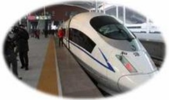
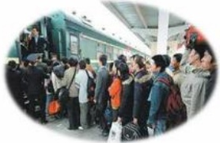

## DÍ

## 乘坐飞机时：

1、乘坐中国民航班机禁止旅客使用手机，确保处于关机状态。飞机上请勿使用手机，尤其是起飞和降落阶段。禁止使用的电子设备还有对讲机、遥控玩具和其他带遥控装置的电子设备等。

2、随身携带物品可放在上方的行李架上，较重物品可放在座位下面。

3、如发生误机，最迟应在航班离站后的次日中午12点(含)以前到乘机机场确认。如果要求改乘后续航班，各航空公司将在航班有可利用座位的条件下予以办理，免收误机费一次。

4、按登机牌确定的位置就座。

5、不要随意触动紧急出口等安全设施。

6、不要将机上救生衣等设备带走。

7、飞机经停某机场时千万不要不辞而别，如需改变行程，请与工作人员联系。

8、乘坐飞机时候，请您不要和机组人员、其他旅客、朋友开关于安全的玩笑。

## DL

## 乘坐火车时：

1、上车前后避免拥挤。上车时和开车前，站台上及车厢内人多拥挤，此时注意力都集中在办理上车手续、寻找车厢和座位上，容易忽略了自己的行李及口袋内的手机和钱包。因此，进站上车时要听从工作人员指挥，有序排队进站上车，避免互相拥挤给小偷制造机会。

2、中途停车看住行李。一些职业扒手会假扮旅客，携带简单行李，买一张短途火车票，混入车厢中，伺机作案，得手后下车逃脱。因此，列车停车前，要特别注意自己的行李物品，防止别的下车旅客拿错行李和小偷趁乱行窃。

3、尽量减少下车购物。沿途一些停靠站由于不是封闭式车站，可能有小偷在站台上趁旅客下车购物时盗窃旅客随身携带的物品。因此，到站后旅客应尽量减少下车，如需下车购物时要多加小心。

