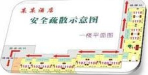

## DÍ

4、警惕有人频翻行李。一些不法分子会携带大行李袋或与旅客相同的行李袋上车，并放在一起，在旅途中频频爬上行李架假装取自己的东西，借机翻动旅客行李行窃。因此，上车摆放行李时要避免形状与颜色相同的行李放在一起以免下车时拿错。

5、夜间瞌睡别忘行李。当列车进入夜间行车时，硬座车厢的旅客往往打起瞌睡。此时不法分子往往借机行事，找机会下手。若是老乡或亲友同行，应采取分时睡觉，留一人看护行李。如单身旅行，可与同座位的旅客互相提醒。

6、防人之心不可缺少。一些不法分子会利用“老乡”、“同行”等借口主动搭讪，或主动赠送食品及物品，在你放松警惕时实施诈骗和盗窃。旅途中，不要将自己的行李物品交给不认识或认识不久的人看管。不要吃喝不认识或认识不久的人赠送的饮料或食品。

## DL

## 住宿注意事项：

1、应首先选择选择正规的酒店。

2、选择那些治安环境好非住宿人员不能随意进入，能够保证人身和财产安全的宾馆（饭店）。

3、入住前，应确认宾馆（饭店）具有完善的消防设施及安全通道。

4、进入房间时，首先认真阅读宾馆（饭店）消防逃生图，了解所在位置的逃生路线及逃生通道门能从楼道内打开。

5、应遵守宾馆（饭店）的安全要求

6、不要将自己住宿的酒店、房号随便告诉陌生人。

