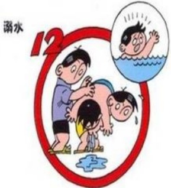

## 防溺水安全知识

## （三） 夏季游泳溺水自救方略

如何保证游泳的健康和安全，避免溺水事件的发生？对水情不熟而贸然下水，极易造成生命危险。万一不幸遇上了溺水事件，专家介绍，溺水者切莫慌张，应保持镇静，积极自救：

（1）对于手脚抽筋者，若是手指抽筋，则可将手握拳，然后用力张开，迅速反复多做几次，直到抽筋消除为止；

（2）若是小腿或脚趾抽筋，先吸一口气仰浮水上，用抽筋肢体对侧的手握住抽筋肢体的脚趾，并用力向身体方向拉，同时用同侧的手掌压在抽筋肢体的膝盖上，帮助抽筋腿伸直；

（3）要是大腿抽筋的话，可同样采用拉长抽筋肌肉的办法解决。

## 卫生与健康：

1、出行前了解所到地点的气候温度信息。备好服装和应急常用药品。

2、游玩要适度，娱乐要量力而行，保证游玩之余要有充足的休息时间。

3、饮食要卫生干净，不要暴饮暴食。饮酒不要过量，不强行劝酒，严禁酗酒。

