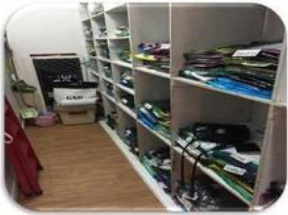

## 一、 安全

## 员工上下班安全规定

1、严禁酒后驾车、无证驾驶、将车交无证人员驾驶；

2、不准闯红灯、逆向行驶、超速行驶；

3、驾驶车辆时需系安全带，不允许穿拖鞋、高跟鞋，不允许吸烟，不允许接打电话；

4、骑助力车、电动车、自行车不准进入机动车道，行人不允许横跨交通护栏，要走人行横道、斑马线；

5、驾驶摩托车、踏板电动车上下班，必须正确戴好安全头盔以及安全反光带；

6、上道路行驶前，应当对汽车、摩托车、电动车的安全技术性能进行认真检查；不要驾驶安全设施不全等具有安全隐患的汽车、摩托车、电动车；

7、按规定停放车辆，离开车辆时应对车辆采取制动措施，并确认安全，以防发生意外事故；

8、机动车发生故障及事故时，应开启双闪灯，并将机动车移至不妨碍交通的地方停放，难以移动的应持续开启双闪灯，并在来车方向设置警告标志等措施，扩大示警距离，必要时迅速报警并上报主管，人员撤离到安全地带（报警要讲清事故发生的时间、地点、主要情况和造成的后果）；

9、因公出差人员或外派（驻外）人员，身处异地，更要加强自我保护、自我防范意识，避免意外交通事故和人身伤害事故发生。

## 工作篇--抢劫事件

## 三、 盗窃事件

## 案例：

1、三楼一员工丢失刚发完的工资3000元左右；

2、二楼一员工丢失手机一部：

3、超市一员工丢失手机一部：

4、四楼一员工丢失手机一部：

5、五楼电影丢失手机、现金；

6、三楼一员工多次丢失现金800元左右

处理方法：

①上班不要随身携带过多的现金；

②手机、钱包等贵重物品不要随意摆放；（如：仓库、柜台抽屉等）

## 工作篇--盗窃事件

③发完工资要及时存进银行，不要遗留在卖场；

④进出仓库及时上锁，特别是试衣间和仓库相连的；

⑤丢失后不要过多的声张，也不要自作主张去怀疑指责别人；

⑥及时通知主管及保安。

