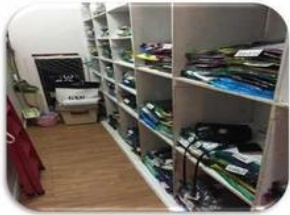

## 三、 盗窃事件

## 案例：

1、三楼一员工丢失刚发完的工资3000元左右；

2、二楼一员工丢失手机一部；

3、超市一员工丢失手机一部：

4、四楼一员工丢失手机一部：

5、五楼电影丢失手机、现金：

6、三楼一员工多次丢失现金800元左右

## 处理方法：

①上班不要随身携带过多的现金；

②手机、钱包等贵重物品不要随意摆放；（如：仓库、柜台抽屉等）

③发完工资要及时存进银行，不要遗留在卖场；

④进出仓库及时上锁，特别是试衣间和仓库相连的；

⑤丢失后不要过多的声张，也不要自作主张去怀疑指责别人；

⑥及时通知主管及保安。

## 防盗 可疑偷窃者的特征

1、手推车中放着敞口手提包的顾客应加以注意。

2、应特别注意把物品放在手推车周围而留下中间以备打包用的顾客。

3、顾客携带“反常”物品时，须多加防备。如：晴天带雨伞等。

4、手拿着货品，在店内四处走动。

5、在短时间内多次进出商场或来到本区域（拿相同商品）的人；

