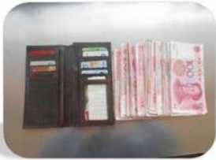
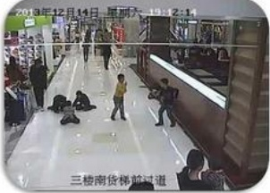
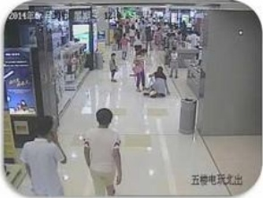

## DÍ

## 五、 突发事件案例：

## 顾客丢失物品：

1、2013年顾客在二楼丢失现金7000元，家园卡5000元；

2、2014年顾客在四楼丢失现金10000元左右：

3、2014年顾客在五楼电玩丢失钱包一个，内有现金20000元

4、2015年顾客先后在五楼三楼丢失现金25000元左右。

## 处理方法：

第一、安抚顾客情绪：

第二、通知楼层保安并告知详情。

## 顾客摔伤碰伤：

1、2013年三楼一六岁左右的孩子被玻璃砸伤；处理方法：

2、2013年三楼一九岁的孩子被摔断牙齿；

第一、查看顾客摔伤情况，严重

3、2014年手扶电梯一三岁左右的孩子被夹伤；的拨打120；

4、2014年一六岁小女孩摔到专厅地台上，造成眉骨断裂；第二、及时通知楼层主管及保安。

5、2015年一楼—70岁老太太摔伤造成脊椎骨折。

