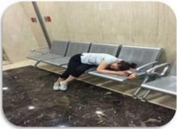
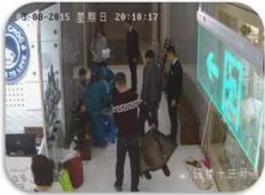
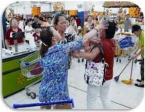
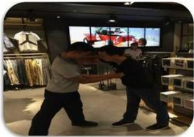

## 顾客晕倒：

1、2014年三楼某专厅一位30岁左右的女顾客晕倒；

2、2015年五楼一位六十岁左右的老大爷晕倒；

3、2015年四楼一位70岁左右的老太太晕倒。

## 处理方法：

第一、查看顾客情况（是否有陪同，顾客状况）严重时及时拨打120；

第二、在120到来前不要移动顾客，同时疏散周围的顾客，保持空气流通；

第三、通知楼层主管及保安

## 顾客打架：

1、2016年超市收银台双方顾客发生争执；

2、2016年二楼两女顾客发生争执：

3、2017年电梯上双方顾客发生争执；

4、2017年餐饮双方顾客发生争执。

## 处理方法：

第一、查看现场状况，保护好自身安全，严重时及时拨打110，有人受伤及时拨120；

第二、及时通知楼层主管及保安。

