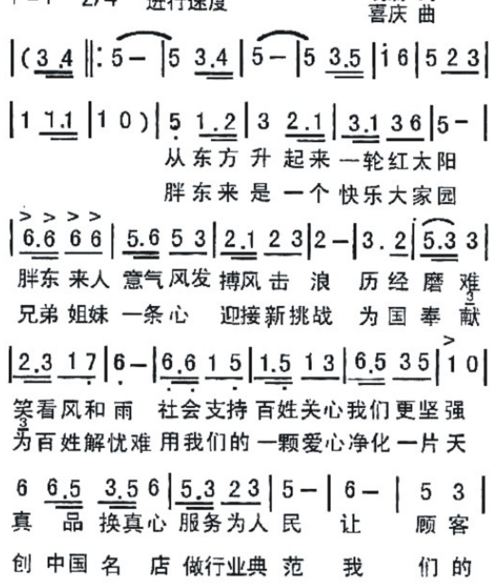
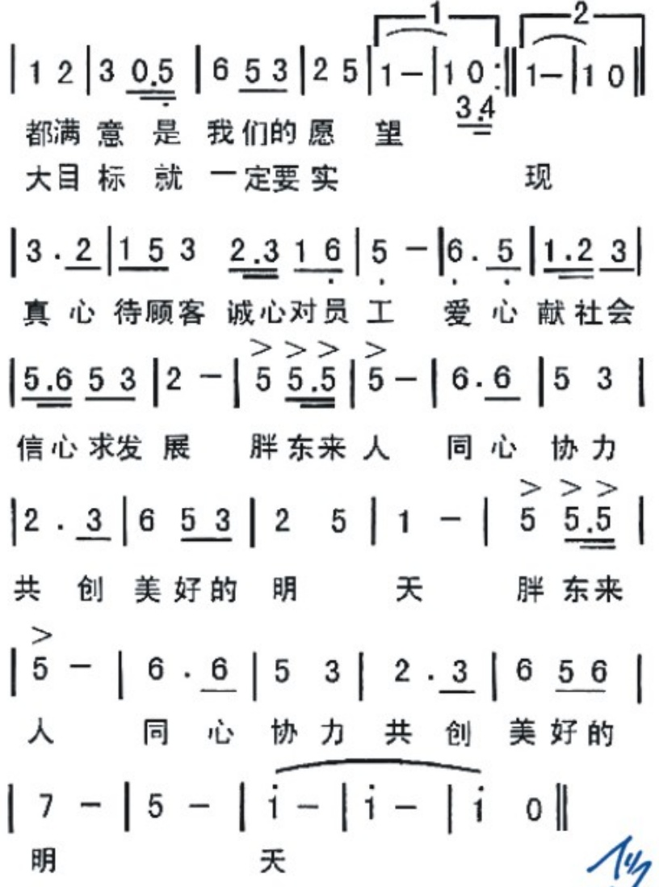

## 胖东来之歌

DÍ

胖东来

1 = F 2/4 进行速度

晓蔚词

喜庆曲

 $ ^{3} $为百姓解忧难用我们的一颗爱心净化一片天

6  $ \underline{6.5} $  $ \underline{3.5} $ 6  $ \underline{5.3} $  $ \underline{23} $ | 5- | 6- | 5 3 |

真 品 换 真 心 服务 为 人 民 让 顾客

创 中国 名 店 做 行业 典 范 我 们的

